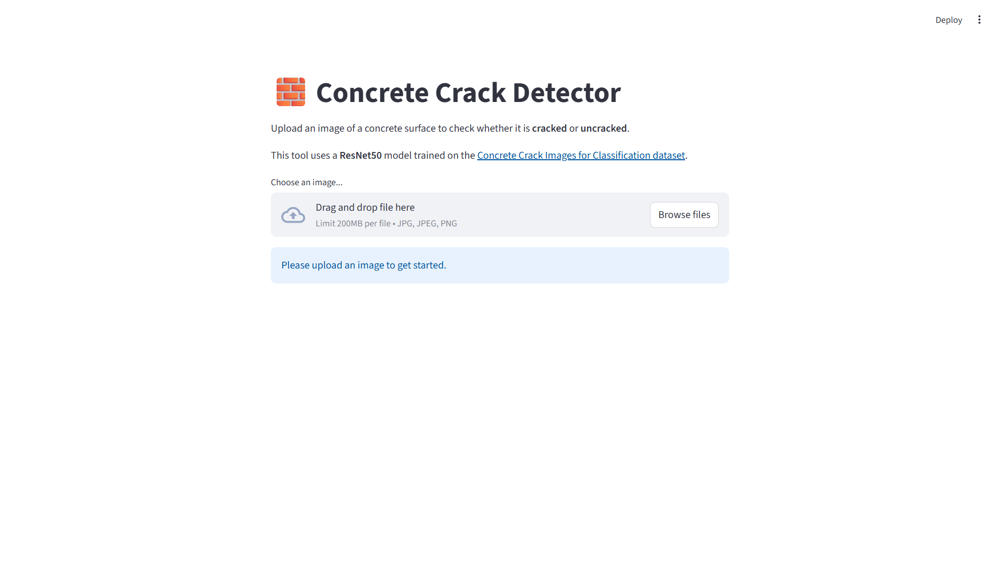

# 🧱 Concrete Crack Detector

A simple web app built for my **AI & Data Science (AIDS)** course that detects cracks in concrete surfaces using a deep learning model.

👉 **Live Demo:** [Click here to view the app](https://your-app-name-on-heroku.herokuapp.com/)  
*(Replace this with your actual deployed app link)*

---

## 🧠 Project Overview

This project uses a **pre-trained ResNet50** model to classify images of concrete surfaces as **Cracked** or **Uncracked**.  
The app provides an easy-to-use web interface built with **Streamlit**.

### How it Works
1. Upload an image of a concrete surface.
2. The image is resized and preprocessed.
3. The model analyzes it using a ResNet50 architecture.
4. The app outputs whether it’s *Cracked* or *Uncracked* and shows the confidence score.

---

## 🖼️ App Preview

When you upload an image, the app displays the result and confidence level.

---

## 🧩 Model Details

The model is based on **Transfer Learning** using ResNet50:

- Pretrained on **ImageNet**  
- Fine-tuned on the **Concrete Crack Images for Classification** dataset  
- Trained using **TensorFlow** and **Keras**

Transfer learning drastically improves accuracy and reduces training time compared to building a model from scratch.

